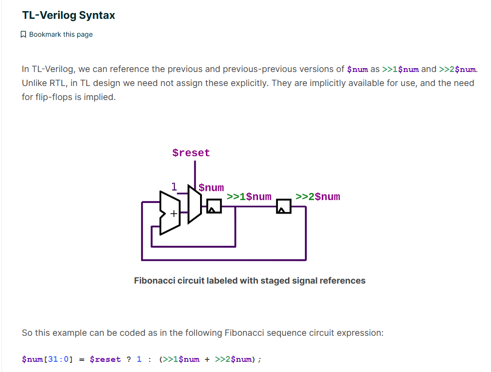
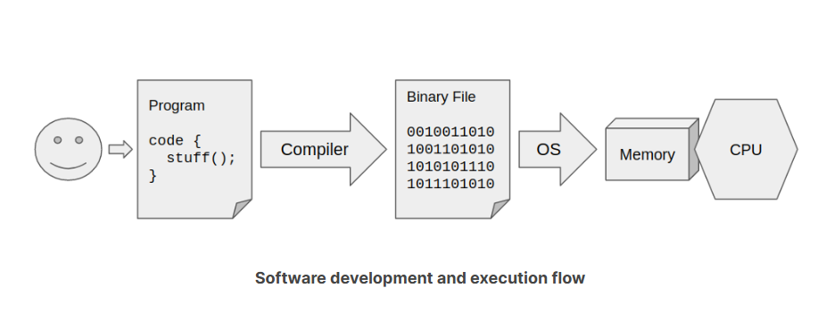
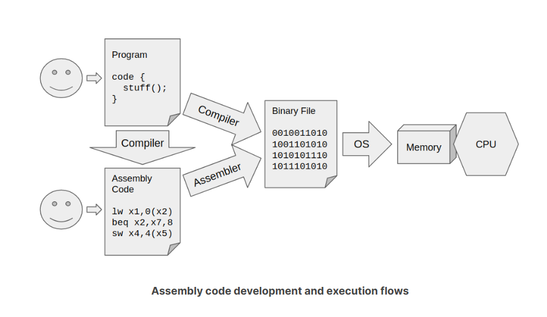
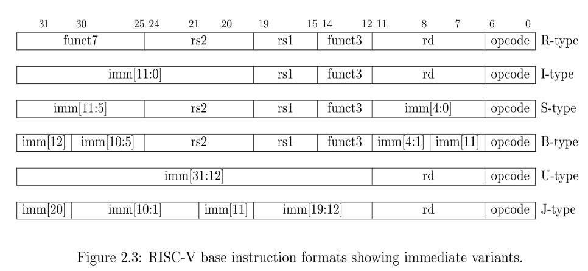

# build_a_RISC-V_CPU_core

website:
```
https://learning.edx.org/course/course-v1:LinuxFoundationX+LFD111x+1T2024/home
```
### Motivation
(使用的语言与verilog还是有一些区别的)
For those curious about the motivation for this file structure, it is necessary to understand the strategy for evolving TL-Verilog from Verilog. The ultimate goal is to eventually introduce a new modeling language philosophically different from Verilog in all respects. This will play out over the next decade or decades. In the meantime, we work toward this incrementally, layering on Verilog as a working starting point, with TL-Verilog as a language extension to Verilog. This layering also provides an essential and incremental migration path. And, as tools mature, it is always possible to fall back on Verilog.

**Also noteworthy is the fact that TL-Verilog is really a Verilog implementation of TL-X, a language extension defined to layer atop any HDL to extend it with transaction-level features. So there is a migration path from any supported HDL (and, as of this writing, Verilog is the only one).**

By using TL-Verilog syntax only within module definitions, Verilog-based tools that are used to stitch the interconnections between modules can remain blissfully unaware of TL-Verilog. Within the Verilog module, other forms of modularity and hierarchy, particular to TL-Verilog can be employed.

Everything we will do in this course will be inside the \TLV region, but now you understand how this connects with Verilog-based tools.

### Clock
虽然也有触发器作用于时钟的下降沿，但我们的电路只会在上升沿工作。

The clock is driven throughout the circuit to "flip-flops" which sequence the logic. Flip-flops come in various flavors, but the simplest and most common type of flip-flop, and the only one we will concern ourselves with, is called a "positive-edge-triggered D-type flip-flop". These drive the value at their input to their output, but only when the clock rises. They hold their output value until the next rising edge of their clock input.

### TL-Verilog Syntax



### ch3 The Role of RISC-V
This chapter describes, at a high level, the role played by RISC-V and how it fits into the scene. **How does a program get compiled and eventually execute on a RISC-V CPU core?**

By the end of this chapter, you should understand:

- The role of compilers and assemblers.
- The role of an instruction set architecture (ISA).
- The general properties of RISC-V versus other ISAs.

---

#### Software, Compilers, and CPUs
Likely, you have experience writing programs in languages like Python, JavaScript, Java, C++, etc. These languages are portable and can run on just about any CPU hardware. CPU’s do not execute these languages directly. They execute raw machine instructions that have been encoded into bits as defined by an instruction set architecture (ISA). Popular ISAs include x86, ARM, MIPS, RISC-V, etc.

A *compiler* does the job of translating a program’s source code into a *binary file* or executable containing machine instructions for a particular ISA. An operating system (and perhaps a runtime environment) does the job of loading the binary file into memory for execution by the CPU hardware that understands the given ISA.  
【commonly:】  

————————我是一条线—————————

*The binary file is easily interpreted by hardware*, but not so easily by a human. **The ISA defines a human-readable form of every instruction, as well as the mapping of those human-readable assembly instructions into bits.** In addition to producing binary files, compilers can generate assembly code. An assembler can compile the assembly code into a binary file. In addition to providing visibility to compiler output, assembly programs can also be written by hand. This is useful for hardware tests and other situations where direct low-level control is needed.   
(You will use assembly-level test programs in this course to debug your RISC-V design.)  
【but exactly:】  


#### almost start
 In this course, you will build a simple CPU that supports the RISC-V ISA.   
 
 RISC-V has very rapidly gained popularity due to its open nature--its explicit lack of patent protection and its community focus. Following the lead of RISC-V, MIPS and PowerPC have subsequently gone open as well

 **You will implement the core instructions of the base RISC-V instruction set (RV32I), which contains just 47 instructions. Of these, you will implement 31 (Of the remaining 16, 10 have to do with the surrounding system, and 6 provide support for storing and loading small values to and from memory).
**

All instructions are 32 bits. 

Like other RISC (and even CISC) ISAs, RISC-V is a load-store architecture. It contains a register file capable of storing up to 32 values (well, actually 31). Most instructions read from and write back to the register file. Load and store instructions transfer values between memory and the register file.  

- **opcode**  
Provides a general classification of the instruction and determines which of the remaining fields are needed, and how they are laid out, or encoded, in the remaining instruction bits.
- **function field** (funct3/funct7)  
Specifies the exact function performed by the instruction, if not fully specified by the opcode.
- **rs1/rs2**
The indices (0-31) identifying the register(s) in the register file containing the source operand values on which the instruction operates.
- **rd**  
The index (0-31) of the register into which the instruction’s result is written.
- **immediate**  
A value contained within the instruction bits themselves. This value may provide an offset for indexing into memory or a value upon which to operate (in place of the register value indexed by rs2).  


You’ll learn further details of the ISA as you build your CPU.

---

### RISC-V-Subset CPU
#### finally alomost start
In this chapter, you will build a subset of your RISC-V CPU core capable of executing a test program that adds numbers from 1 to 9. Subsequently, you will complete the functionality of your core.