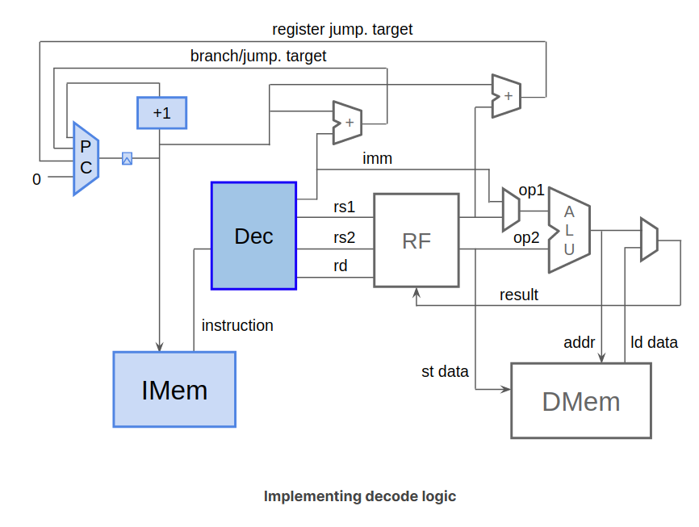
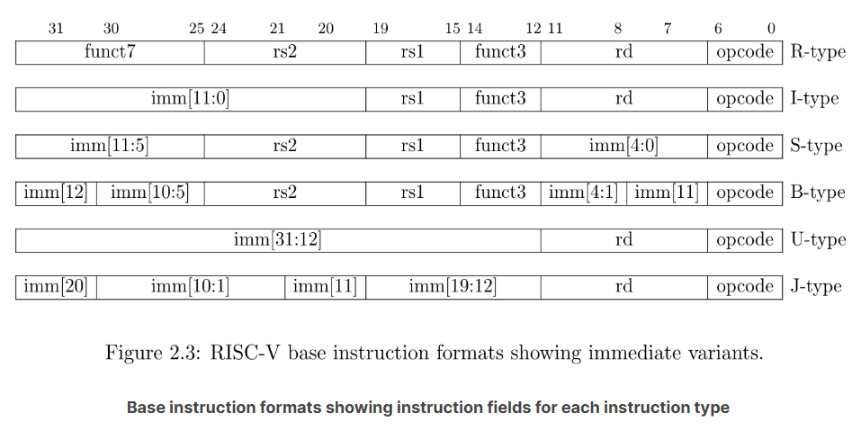
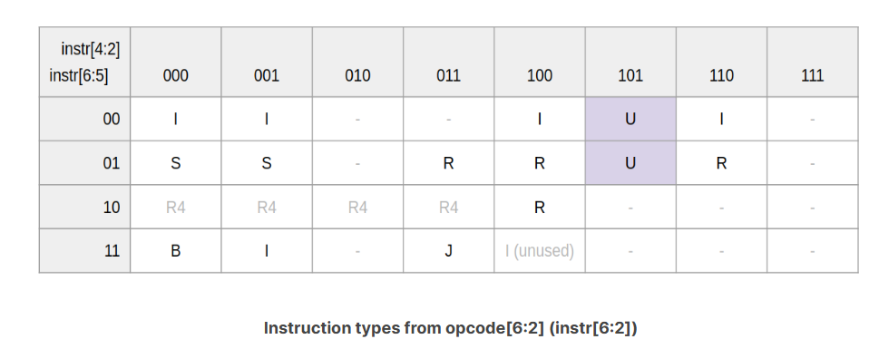
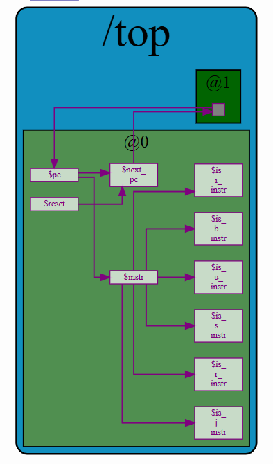

## Decode Logic: Instruction Type

### how

Before we can interpret the instruction, we must know its type. This is determined by its opcode, in $instr[6:0]. **In fact, $instr[1:0] must be 2'b11 for valid RV32I instructions.** We will assume all instructions to be valid, so we can simply ignore these two bits. The ISA defines the instruction type to be determined as follows.

### result

