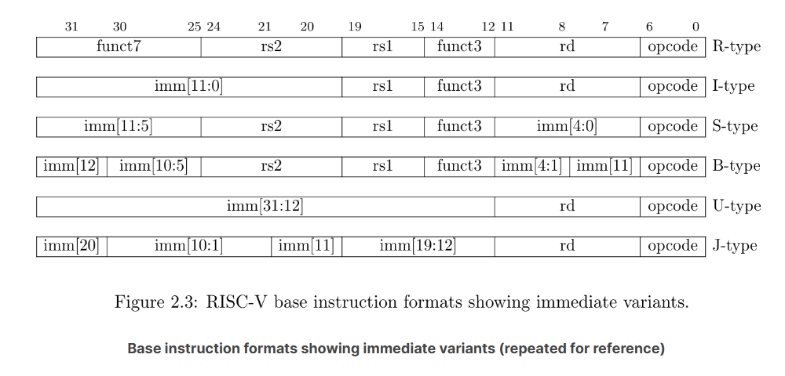
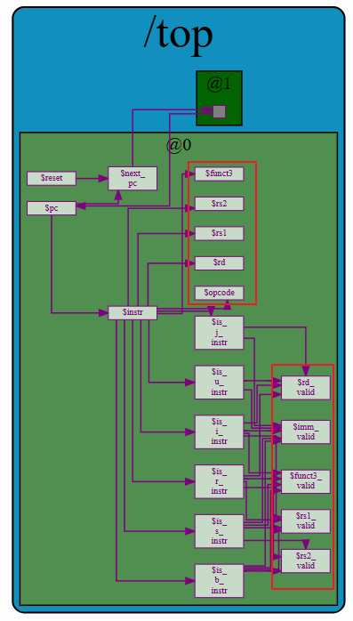
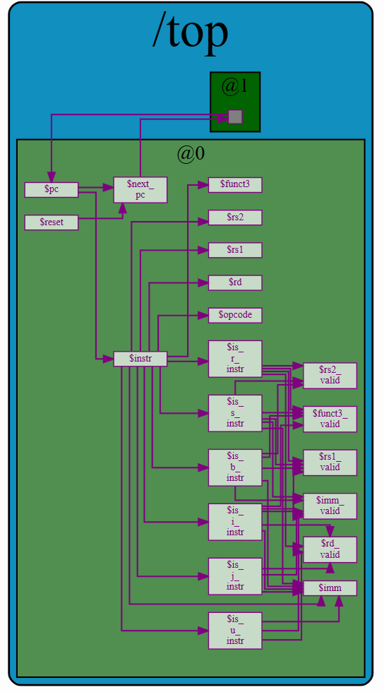

## Decode Logic: Instruction Fields

(how immediate concat)
- 前面表示inst[31]的复制，直到占满31到11位
- 为了保持格式一致，所以写成分开的形式——比如I格式的imm的后面，其实用一个inst[30:20]就可以表示

### result

#### fields(except funct7 & imm)

#### add 'imm' field

