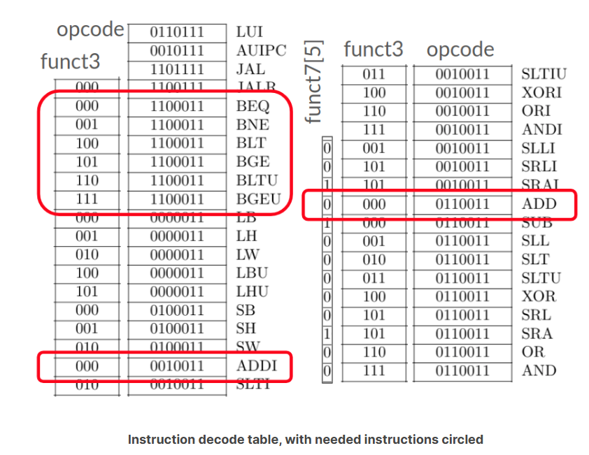

## Decode Logic: Instruction
### verilog
Verilog 允许使用下划线 (_) 来分隔二进制数，以提高代码的可读性。下划线本身不影响数值。  
如: 11'b0_0001_110110

框中的是需要实现的
### instructions

分支指令 (B-type): 这些指令根据条件比较的结果，决定是否跳转到目标地址。
- BEQ (Branch if Equal): 如果 rs1 寄存器的值等于 rs2 寄存器的值，则跳转到目标地址。  
    - 例子: beq x10, x11, label (如果 x10 等于 x11，则跳转到 label)
- BNE (Branch if Not Equal): 如果 rs1 寄存器的值不等于 rs2 寄存器的值，则跳转到目标地址。
    - 例子: bne x5, x6, label (如果 x5 不等于 x6，则跳转到 label)
- BLT (Branch if Less Than): 如果 rs1 寄存器的值小于 rs2 寄存器的值（有符号比较），则跳转到目标地址。
    - 例子: blt x20, x21, label (如果 x20 小于 x21，则跳转到 label)
- BGE (Branch if Greater than or Equal): 如果 rs1 寄存器的值大于等于 rs2 寄存器的值（有符号比较），则跳转到目标地址。
    - 例子: bge x1, x2, label (如果 x1 大于等于 x2，则跳转到 label)
- BLTU (Branch if Less Than, Unsigned): 如果 rs1 寄存器的值小于 rs2 寄存器的值（无符号比较），则跳转到目标地址。
    - 例子: bltu x7, x8, label (如果 x7 小于 x8 (无符号)，则跳转到 label)
- BGEU (Branch if Greater than or Equal, Unsigned): 如果 rs1 寄存器的值大于等于 rs2 寄存器的值（无符号比较），则跳转到目标地址。
    - 例子: bgeu x3, x4, label (如果 x3 大于等于 x4 (无符号)，则跳转到 label)  

算术指令:
- ADDI (Add Immediate): 将一个立即数加到寄存器的值上，并将结果存储到目标寄存器中。
    - 例子: addi x10, x10, 5 (将 x10 的值加上 5，然后将结果存储回 x10)
- ADD (Add): 将两个寄存器的值相加，并将结果存储到目标寄存器中。
    - 例子: add x5, x10, x15 (将 x10 和 x15 的值相加，并将结果存储到 x5)  

说明:
1. rs1 和 rs2 代表源寄存器。
2. rd 代表目标寄存器。
3. label 代表跳转的目标地址的标签。