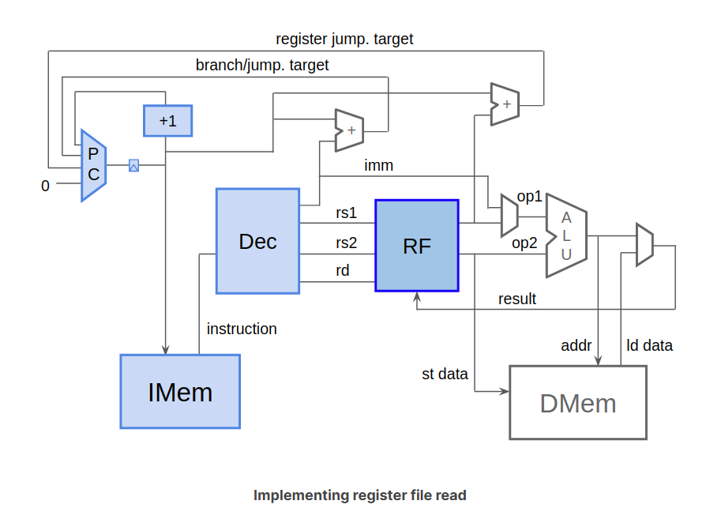
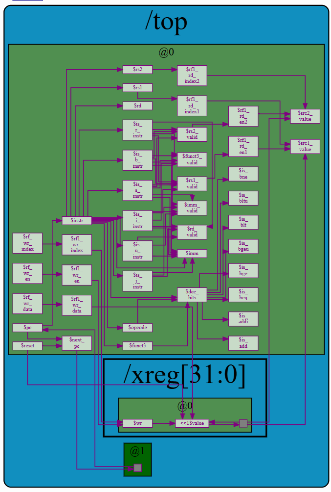

## Register File Read
and now we are here


This time, rather than using a Verilog module or macro as we did for IMem, we will use a TL-Verilog array definition, expanded by the M4 macro preprocessor.

### how
定义：取消m4+rf那一行的注释,一开始RF的行为是随机的

然后修改参数：（除了src1_value 和src2_value，替换为已经有的变量）
```
   //RF read
   //change arguments in m4+rf()

   //$rd_en2 = $rs2_valid;
   //$rd_en1 = $rs1_valid;
   //and src $rd_data1=$src1_value and $rd_data2=$src2_value
   //$rd_index1 = $rs1;
   //$rd_index2 = $rs2;
```

### res
操作中能读取正确，这一步就对了  
