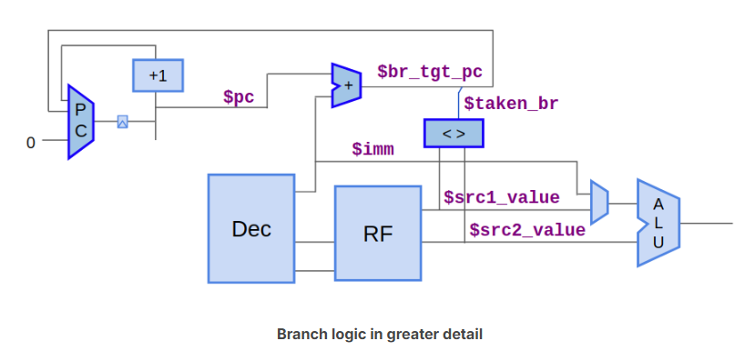
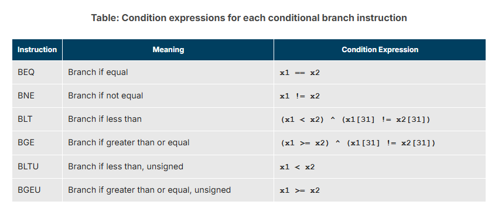
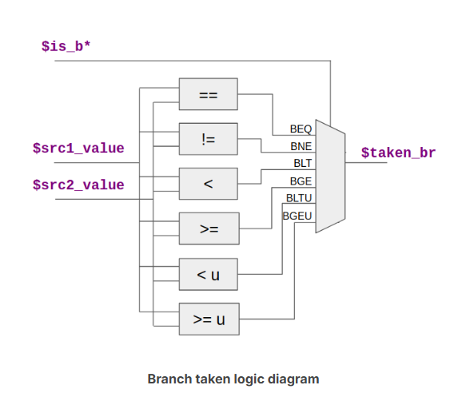

## Branch Logic
now you are back here:  

- The last piece of the puzzle to get your test program executing properly is to implement the branch instructions. 

### how
A conditional branch instruction will branch to a target PC if its condition is true. Conditions are a comparison of the two source register values. Implementing conditional branch instructions will require:  
- Determining whether the instruction is a branch that is taken ($taken_br).
- Computing the branch target ($br_tgt_pc).
- Updating the PC ($pc) accordingly.

### you must need this
  

---

### res
what to do?
1. $taken_br
2. $br_tgt_pc
3. "add one condition" in $next_pc
4. replace the line "*passed = 1'b0" with m4+tb()——and it says simulation PASSED in Log

### final
wow, you completed Chapter 4