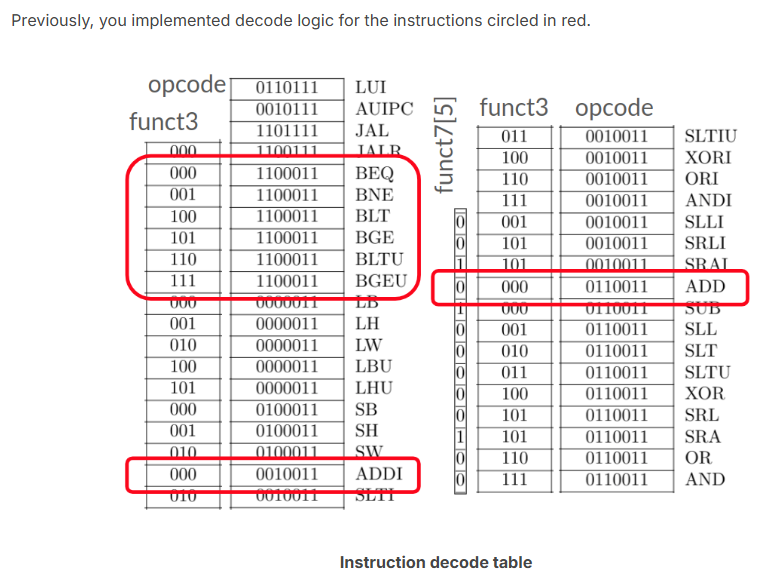

## Decode Logic

  
实现剩余指令:  
With the exception of load and store instructions (LB, LH, LW, LBU, LHU, SB, SH, SW), complete the decode logic for the remaining non-circled instructions above ($is_<instr> = …). 

### how
解码
用$is_xxx存起来

### res

