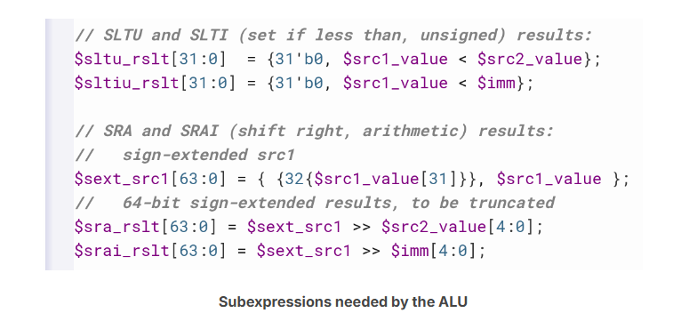
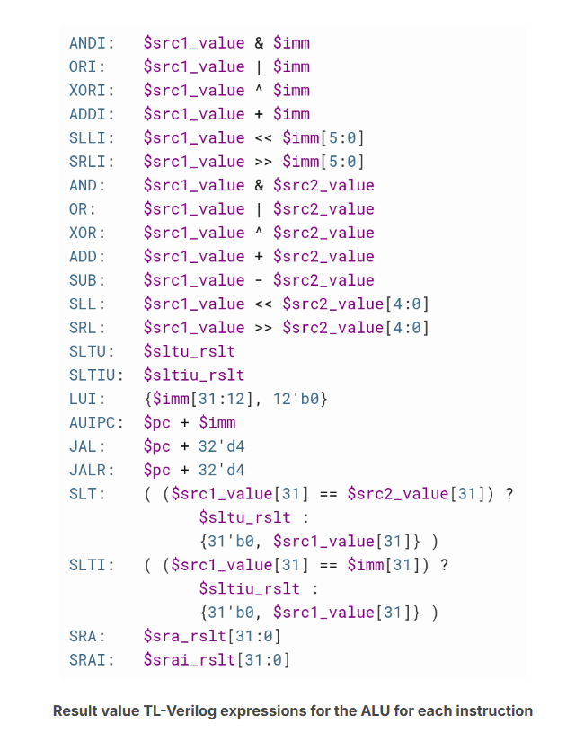

## arithmetic logic unit
A few have common subexpressions, so let’s first create assignments for these subexpressions.  

complete ALU:  

### how
$result  

$sltu_rslt  
$sltiu_rslt  
$sext_src1  
$sra_rslt  
$srai_rslt  

### res

