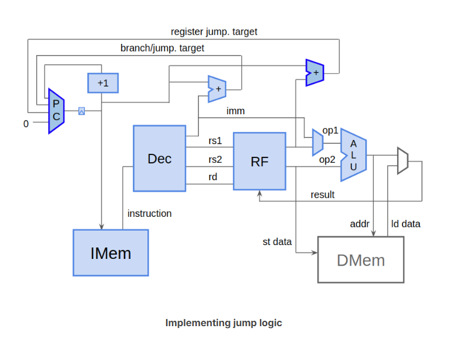

## Jump Logic

RISC-V支持两种形式的跳转：
JAL：Jump to (PC + IMM)  
JALR: Jump to (SRC1 + IMM)
### how

### res

 In the test program, JAL and JALR instructions should jump to the next subsequent instruction (as if not jumping at all), with the exception of the final JAL, which should jump to itself. Assuming x30 is also properly set to 1, this final JAL will result in the test reporting "Passed" in LOG and VIZ (though loads and stores are not working yet). Verify this behavior in VIZ.

 除了最后一条指令，其他的跳转都是直接执行下一条  
 关于simulation passed, 我认为是pass m4+tb()，即x30寄存器是否为1