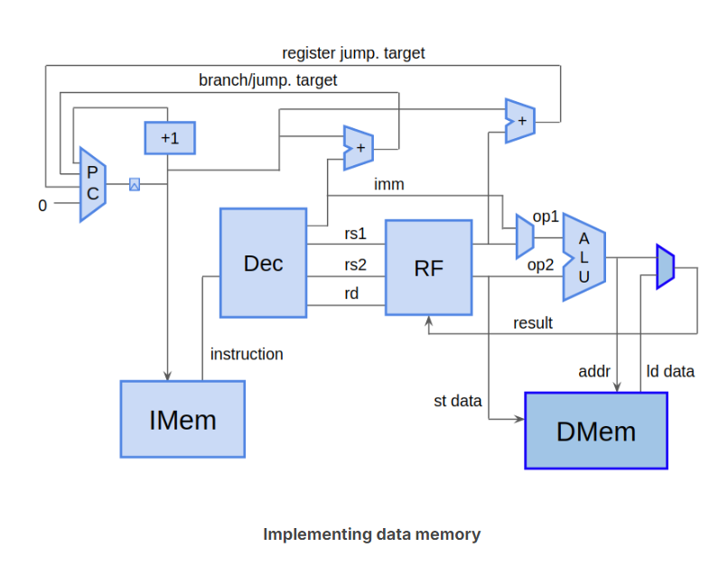

## addressing memory
So far, all of our instructions are operating on register values. What good is a CPU if it has no memory?    

是时候让memory登场了  

Both load and store instructions require an address from which to read, or to which to write. As with the IMem, this is a byte-address. Loads and stores can read/write single bytes, half-words (2 bytes), or words (4 bytes/32 bits).  

可以读/写 1byte | 2bytes | 4bytes  
(一个字节、半个字(word)、一个字(word))  

*只有RISC-V是这样吗？*

### memory的地址怎么计算？
addr = rs1 + imm
(a value of a source register and an offset value(often 0))

## Loads
load指令：LW,LH,LB,LHU,LBU  
都是这样写的:  
```
LOAD rd, imm(rs1)
```


注意最后一行的理解：  
```
rd <= DMem[addr] (where, addr = rs1 + imm)
```

## Stores
store 指令:SW,SH,SB  
```
STORE rs2, imm(rs1)
```


注意最后一行的理解：  
```
DMem[addr] <= rs2(where, addr = rs1 + imm)
```

## Data Memory



### how
不过目前我们只考虑对于word的操作


### res
